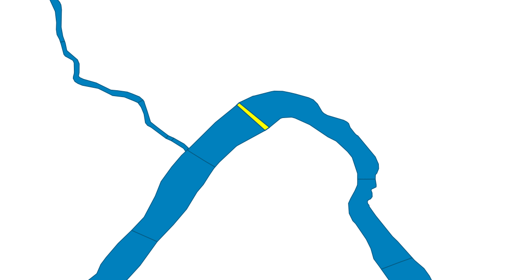

# Attribute Data

In the [previous example](./youre-projecting.html) we worked with geometries using the Well Known Text (WKT) format. It should come as no surprise that solving geospatial problems fundamentally involves geometry, but it's rarely about *exclusively* geometry. Usually there is some other attribute data associated with that geometry that we want want to explore. This combination of a geometry with its associated attribute data is often referred to as a _feature_, and a group of features is called a _feature collection_.


Philadelphia has a lot of water. The Delaware River defining it's eastern boundary, the Schuylkill River running through the city from the North West. The Wissahickon is a local favorite spot for a natural reprieve. Other water ways, like [Mill Creek] have been paved over, only making themselves known through the occasional appearance of gaping sink holes.

(TODO: picture of sinkhole?)

How do we cross all this water? It'd be helpful to know which segments of the waterways have a bridge.

Because WKT can only represent geometry, and has no way to represent attribute data, like whether or not that geometry has a bridge, a common approach is to create a CSV (comma separated value) file where one column contains the WKT geometry, and the other columns contain the attribute data - i.e. whether or not it's bridged.

This [CSV of Philadelphia's water ways](TODO.csv) does just that. Here's an excerpt:



| creek_name        | watershed         | inf1    | geometry           |
|-------------------|-------------------|---------|--------------------|
| Cobbs Creek       | Cobbs Creek       |         | MULTIPOLYGON(....) |
| Cobbs Creek       | Cobbs Creek       | Bridged | MULTIPOLYGON(....) |
| Wise's Mill       | Wissahickon Creek |         | MULTIPOLYGON(....) |
| Wissahickon Creek | Wissahickon Creek | Bridged | MULTIPOLYGON(....) |
| Wissahickon Creek | Wissahickon Creek |         | MULTIPOLYGON(....) |

And here's how we might tally up how many bridges cross a particular creek, also keeping track of the largest bridge across each waterway.

```rust
use csv;
use wkt;

struct Creek {
  name: String,
  bridge_count: usize,
  largest_bridge_area: f64,
}

// For each creek, count the number of bridges, and keep track of the largest bridge (by area)
let mut creeks: HashMap<String, Creek> = HashMap::new();

let csv_reader = csv::open("philly_waterways.csv");
for waterway_segment in csv_reader.rows() {
  let infrastructure_label = waterway_segment.get("inf1").expect("missing 'inf1' field");

  if infrastructure_label != "Bridged" {
    continue;
  }

  let creek_name = waterway_segment.get("creek_name").expect("missing 'creek_name' field");
  let geometry = waterway_segment.get("geometry").expect("missing `geometry` field");
  let bridge_area = waterway_segment.geometry.unsigned_area();

  if let Some(&mut existing_entry) = bridges.get_mut(creek_name) {
      println!("adding bridge to {creek_name}");
      existing_entry.bridge_count += 1;
      if bridge_area > existing_entry.largest_bridge_area {
        largest_bridge_area = bridge_area
      }
  } else {
    let new_creek = Creek {
      name: creek_name.clone(),
      bridge_count: 1,
      largest_bridge_area: bridge_area
    };
    creeks.insert(creek_name, new_creek);
  }
}

assert_eq!(creeks.values().len(), todo!());
let wissahickon = creeks.get("Wissahickon").expect("missing the Wissahickon");

assert_eq!(wissahickon.bridge_count, todo!());
assert_eq!(wissahickon.largest_bridge_area, todo!());
```

__mjk: this code block feels pretty large.__

Neat huh? One thing you may have noticed is the repetitive nature of all the error checking:

```rust,ignore
let infrastructure_label = waterway_segment.get("inf1").expect("missing 'inf1' field");
let creek_name = waterway_segment.get("creek_name").expect("missing 'creek_name' field");
let geometry = waterway_segment.get("geometry").expect("missing `geometry` field");
```

For each row in the CSV, getting fields by name in an ad-hoc fashion, is simple, but a bit loosey goosey. And it requires some rote error checking code. If we want to add a little more *struct*ure to the world, we can parse each row into a rigidly `defined struct` leveraging the excellent [`serde`](https://serde.rs) crate. This gives us a concise way to declare what we expect to be in our input and avoids writing out some repetitive error checking code.

Recall from the above example that `philly_waterways.csv` looked like this:

| creek_name        | watershed         | inf1    | geometry           |
|-------------------|-------------------|---------|--------------------|
| Cobbs Creek       | Cobbs Creek       |         | MULTIPOLYGON(....) |

We can describe this schema as a rust struct like this:

```rust
#[derive(serde::Deserialize)]
struct CreekSegment {
  creek_name: String,
  watershed: String,

  // To use a more descriptive name for this field than our source CSV uses,
  // serde offers some customiziations.
  #[serde(rename = "inf1" )]
  infrastructure_label: String,

  #[serde(deserialize = "wkt::deserialize" )]
  geometry: MultiPolygon<f64>
}
```

Notice how each field in the `CreekSegment` struct corresponds to the columns in our CSV input. Now, when we read the CSV, we tell our csv reader that we expect each row to have this form, and the compiler will write all the error checking code for us.

```rust
let csv_reader = csv::open("philly_waterways.csv");

// Here's where we tell the csv reader that each row should be deserializable as a CreekSegment.
for row in csv_reader.rows<CreekSegment>() {

  // And this line replaces all of our per-field error checking.
  let creek_segment: CreekSegment = row?;

  // From this point on, we can rest assured that all the fields of
  // `creek_segment` have been successfully populated.

  if creek_segment.infrastructure_label != "Bridged" {
    continue;
  }

  // The rest of the code remains pretty much the same, so it's hidden,
  // but you can reveal it by clicking the icon at the top right.

#   let bridge_area = creek_segment.geometry.unsigned_area();
#
#   if let Some(&mut existing_entry) = bridges.get_mut(creek_name) {
#       println!("adding bridge to {creek_name}");
#       existing_entry.bridge_count += 1;
#       if bridge_area > existing_entry.largest_bridge_area {
#         largest_bridge_area = bridge_area
#       }
#   } else {
#     let new_creek = Creek {
#       name: creek_segment.creek_name.clone(),
#       bridge_count: 1,
#       largest_bridge_area: bridge_area
#     };
#     creeks.insert(creek_segment.creek_name, new_creek);
#   }
}
#
# assert_eq!(creeks.values().len(), todo!());
# let wissahickon = creeks.get("Wissahickon").expect("missing the Wissahickon");
#
# assert_eq!(wissahickon.bridge_count, todo!());
```

Using structs just gives you a way to put a little more order into your work. And it gives you a place to add functionality. For example:


```rust
impl Creek {
  fn bridge_area(&self) -> f64 {
    self.geometry.unsigned_area()
  }
}
```

Using serde and structs is completely optional. If you prefer the ad-hoc style of the original example, accessing fields by name, and don't care about adding tidy helper methods to the struct, that's totally fine. Skip it.

## MJK: Everything following is very WIP

CSV is a nice format in some ways. For one, tons of programs can read and write CSV (for example any spreadsheet app!). In many other ways however, it is an old and crappy format. There's a couple things about the above data which, though might not be obvious at first, can complicate analysis.

If someone sends you a CSV, how does it represent it's geometry? There is no strong convention for what the geometry columns are called, and though WKT is common, it's far from universal, so whenever you encounter geographic data sources as a CSV you have to dig around a bit to figure out what's what.

Another problem: numeric vs string type isn't always clear
Another problem: Inefficient representation (e.g. representing a 64 bit float as text might take a lot more bytes than necessary)

## OMG GeoJSON

GeoJSON is a different with a different set of tradeoffs.

It's pretty popular, especially useful on the web, because it's, well JSON. Which web browsers understand natively, so it's easy for programmers to manipulate GeoJSON using javascripts.

GeoJSON has a built in way of expressing attributes *along side* the geometry.

Beyond web applications, many other geospatial tools can interoperate with geojson - e.g. qgis.

```rust
TODO: geojson parsing example
```

Downsides: It's geometry representation is quite verbose (not efficient for humans to read or store/transmit), it's not super readable. Spreadsheets are efficient for editing CSV's. It lacks a spatial index (future topic!), so certain geometric operations are slow. For more efficient alternatives (that have other tradeoffs), rust has support for:

* [Shapefiles (.shp)](https://docs.rs/shapefile) - venerable (and often maligned) format.
* [Geopackage (.gpx)](https://docs.rs/geozero) - the "preferred" format for lots of desktop GIS applications, built on top of sqlite.
* [Flatgeobuf (.fgb)](https://docs.rs/flatgeobuf) - a newer format, well suited for efficient random read-only access.

## Up Next

Combining attributes across multiple data sources using spatial joins.

### Draft Notes

Philadelphia, city of brotherly love, from latin via ancient greek city

The most populous conterminous city/county (Phila. city and Phila. county cover the same area, but have separate governments entities).

Primer on philadelphia sink holes:
https://www.phillymag.com/news/2019/08/02/sinkhole-philadelphia/

Asphalt truck on way to fix streets falls into sinkhole: https://twitter.com/orentalks/status/1070372166867320832 (though this was not in a neighborhood near mill creek, it was allegedly in fish town)
