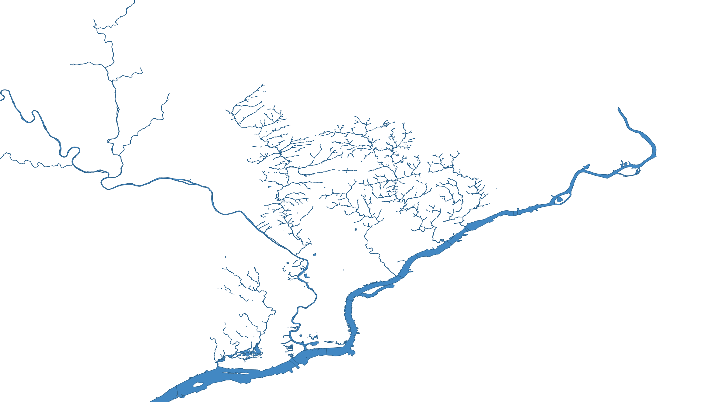
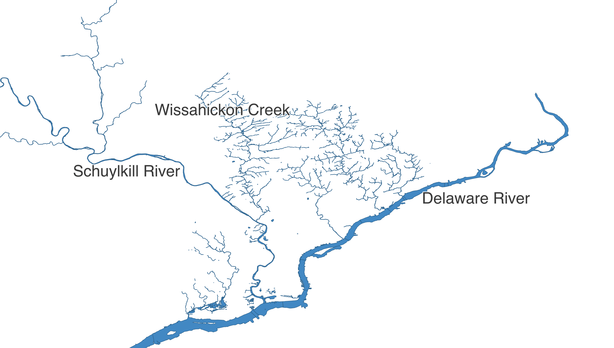
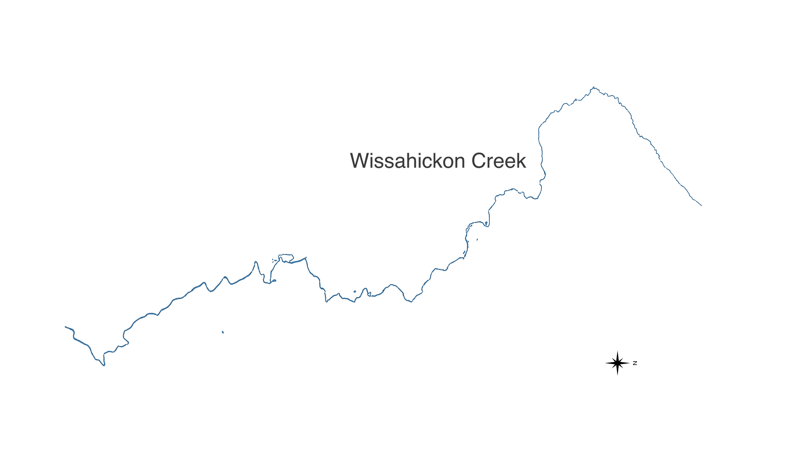

# Feature Creek

In the [previous chapter](./youre-projecting.html) we worked with geometry stored in Well Known Text (WKT) format. It should come as no surprise that solving geospatial problems fundamentally involves geometry, but it's rarely *exclusively* about geometry. Usually there are other attributes associated with that geometry that we also want to explore. This combination of a geometry with its associated attribute data is often referred to as a _feature_, and a group of features can be called a _feature collection_.



In addition to being the "City of Brotherly Love," Philadelphia is also a city of water. We can describe shapes using Well Known Text, and all these waterways can be represented as a long list of WKT declarations:

- `MULTIPOLYGON(....)`
- `MULTIPOLYGON(....)`
- `MULTIPOLYGON(....)`
- ...

## Cry Me a River(s)

It's OK to say "I'm going down to _the_ river" if you live in a town with only one river (shout out to `ACTUAL_TOWNNAME`) but you have to be more specific in Philadelphia. Let's associate some additional information with these shapes:

| creek_name        |  geometry          |
|-------------------|--------------------|
| Wissahickon Creek | MULTIPOLYGON(....) |
| Schuylkill River  | MULTIPOLYGON(....) |
| Delaware River    | MULTIPOLYGON(....) |



Now we're talking specifics! The Delaware River defines Philadelphia's eastern boundary, and the Schuylkill River runs through the city from the North West. Even though it's not in very many spellcheck dictionaries, the Wissahickon is still a favorite for local walkers, so let's amble over that way.

## Bridging the Gap



Walking along the edge of some water is neat, and walking **on** water is an advanced topic for [another book](https://en.wikipedia.org/wiki/Bible), but walking over water? Now that's an infrastructural thrill! So how do we find which segments of the Wissahickon have a bridge? Combining a geometry with other associated data into a _feature_ allows us to solve these kinds of problems.

There are a lot of ways to store geospatial information. Recall that well-known text (WKT) is only concerned with shapes — it can't store whether that geometry represents a bridge or has a name. One approach is to embed WKT into *another* more flexible format such as a CSV file. One column may contain the WKT describing the shape of the feature, and additional columns can include other attributes such as the name of the waterway or whether the segment has a bridge.


This [CSV of Philadelphia waterway segments](data/philly_waterways/philly_waterways.csv) does just that. Here's an excerpt:

| creek_name        | inf1    | geometry           |
|-------------------|---------|--------------------|
| Cobbs Creek       |         | MULTIPOLYGON(....) |
| Cobbs Creek       | Bridged | MULTIPOLYGON(....) |
| Wise's Mill       |         | MULTIPOLYGON(....) |
| Wissahickon Creek | Bridged | MULTIPOLYGON(....) |
| Wissahickon Creek |         | MULTIPOLYGON(....) |
| Wissahickon Creek | Bridged | MULTIPOLYGON(....) |

You'll notice that a single creek is broken into many small segments in this data set. A "Bridged" segment indicates precisely where that bridge exists on the waterway (highlighted in the image above).

## The Short List (A-bridged)

If we're making a handout of fun facts for the "First Annual Wissahickon Walkabout," we might want to figure out how many bridges participants can walk across. Visiting tourists would also probably like to know the size of the largest bridge and where it is located so that they can take a selfie as local fly fishers roll their eyes in the waters below.

Let's use a computer to find the answers:

```rust
use csv;
use geo::algorithm::{Centroid, Area};
use geo::geometry::{Point, Geometry};
use proj::Transform;
use wkt;

let mut csv_reader = {
  use std::fs::File;
  let file = File::open("src/data/philly_waterways/philly_waterways.csv").expect("file path must be valid");
  csv::Reader::from_reader(file)
};

let mut max_bridge_area = None;
let mut max_bridge_location = None;
let mut bridge_count = 0;

for row in csv_reader.records() {
  let creek_segment = row.expect("must be able to read row from CSV");

  let creek_name = creek_segment.get(0).expect("'creek_name' field must be present");

  if creek_name != "Wissahickon Creek" {
    continue;
  }

  let infrastructure_label = creek_segment.get(1).expect("'inf1' field must be present");

  if infrastructure_label != "Bridged" {
    continue;
  }
  bridge_count += 1;

  let geometry_str = creek_segment.get(2).expect("`geometry` field must be present");
  use wkt::TryFromWkt;
  // TODO: why is the explicit <f64> required? I'd think the default trait param would obviate it
  let geometry = Geometry::<f64>::try_from_wkt_str(geometry_str).expect("wkt must be valid");

  // Project from lat/lon to something we can get reasonable area calculations from.
  // Review the previous article on projections for more on this topic.
  //
  // WGS84 - World Geodetic System, aka lat/lon
  // EPSG:2272 - NAD83 / Pennsylvania South (ftUS)
  let bridge_area = geometry.transformed_crs_to_crs("WGS84", "EPSG:2272").unwrap().unsigned_area();

  if let Some(ref mut previous_max) = max_bridge_area {
      if bridge_area > *previous_max {
        *previous_max = bridge_area;
        max_bridge_location = Some(geometry.centroid().expect("a centroid exists for any non-empty geometry"));
      }
  } else {
    // This is the first bridge - so by definition it's the
    // biggest one we've seen so far.
    max_bridge_area = Some(bridge_area);
    max_bridge_location = Some(geometry.centroid().expect("a centroid exists for any non-empty geometry"));
  }
}

assert_eq!(bridge_count, 62);
approx::assert_relative_eq!(max_bridge_area.unwrap().round(), 8199.0);
approx::assert_relative_eq!(max_bridge_location.unwrap(), Point::new(-75.22813045476391, 40.151799193616995));
```

That works, but we can simplify things a bit. One thing you may have noticed is the repetitive nature of `get`ting numbered fields from the CSV while `expect`ing no errors:

```rust,ignore
let creek_name = creek_segment.get(0).expect("'creek_name' field must be present");
let infrastructure_label = creek_segment.get(1).expect("'inf1' field must be present");
let geometry = creek_segment.get(2).expect("`geometry` field must be present");
```

For each row in the CSV, getting fields by number in an ad-hoc fashion like this is simple, but it's a little loosey-goosey: We have to remember what order the fields are in and also write some boring error-checking boilerplate.

## The *Struct*ured Approach

Instead, we can parse each row into a rigidly defined `struct`. Let's take another look at our data:

| creek_name        | inf1    | geometry           |
|-------------------|---------|--------------------|
| Wissahickon Creek | Bridged | MULTIPOLYGON(....) |

This schema can be converted into a Rust struct like this:

```rust
struct CreekSegment {
  creek_name: String,
  inf1: String,
  geometry: geo::geometry::Geometry
}
```

Notice how each field of the `CreekSegment` struct corresponds to a column in our CSV input. From here, we can write code to populate these fields. Parsing information from a CSV file is pretty cutting-edge stuff in the world of Computer Science, but fortunately for us we can stand on the shoulders of giants and turn to the wisdom of those who've deserialized before.

## Serde, Slayer of Boilerplate

The excellent [`serde`](https://serde.rs) crate is a framework for serializing and deserializing data across a variety of formats, and it gives us a concise way to annotate the above struct declaration in order to automatically populate it with data from our CSV.

```rust
#[derive(serde::Deserialize)]
struct CreekSegment {
  creek_name: String,

  // serde offers some customiziations so that we can use sensible
  // names in our code without having to modify our source data, whose
  // names we might not control.
  #[serde(rename = "inf1" )]
  infrastructure_label: String,

  // serde has built-in support for common data types like numbers and strings,
  // and it also allows other crates (like `wkt`) to build custom deserializers
  // so that we can create complex data types (like this `Geometry`)
  // directly from our input data.
  #[serde(deserialize_with = "wkt::deserialize_wkt")]
  geometry: geo::geometry::Geometry
}
```

Finally, before we return to our example, a struct like this is also the perfect place to hang some little helper methods:

```rust
# #[derive(serde::Deserialize)]
# struct CreekSegment {
#   creek_name: String,
#
#   #[serde(rename = "inf1" )]
#   infrastructure_label: String,
#
#   #[serde(deserialize_with = "wkt::deserialize_wkt")]
#   geometry: geo::geometry::Geometry
# }
#
impl CreekSegment {
  fn is_bridge(&self) -> bool {
    self.infrastructure_label == "Bridged"
  }

  fn area(&self) -> f64 {
    use geo::algorithm::Area;
    use proj::Transform;

    // Project from lat/lon to something we can get reasonable area calculations from.
    // Review the previous article on projections for more on this topic.
    //
    // WGS84 - World Geodetic System, aka lat/lon
    // EPSG:2272 - NAD83 / Pennsylvania South (ftUS)
    self.geometry.transformed_crs_to_crs("WGS84", "EPSG:2272").unwrap().unsigned_area()
  }

  fn centroid(&self) -> geo::Point {
    use geo::algorithm::Centroid;
    self.geometry.centroid().expect("a centroid exists for any non-empty geometry")
  }
}
```

Let's see how we can use the above code to clean up our earlier implementation:

```rust
# use csv;
# use geo::algorithm::Area;
# use geo::geometry::{Point, Geometry};
# use wkt;
#
# let mut csv_reader = {
#   use std::fs::File;
#   let file = File::open("src/data/philly_waterways/philly_waterways.csv").expect("file path must be valid");
#   csv::Reader::from_reader(file)
# };
#
# let mut max_bridge_area = None;
# let mut max_bridge_location = None;
# let mut bridge_count = 0;
# #[derive(serde::Deserialize)]
# struct CreekSegment {
#   creek_name: String,
#
#
#   #[serde(rename = "inf1" )]
#   infrastructure_label: String,
#
#   #[serde(deserialize_with = "wkt::deserialize_wkt")]
#   geometry: geo::geometry::Geometry
# }
#
# impl CreekSegment {
#   fn is_bridge(&self) -> bool {
#     self.infrastructure_label == "Bridged"
#   }
#
#   fn area(&self) -> f64 {
#     use geo::algorithm::Area;
#     use proj::Transform;
#     // Project from lat/lon to something we can get reasonable area calculations from.
#     // Review the previous article on projections for more on this topic.
#     //
#     // WGS84 - World Geodetic System, aka lat/lon
#     // EPSG:2272 - NAD83 / Pennsylvania South (ftUS)
#     self.geometry.transformed_crs_to_crs("WGS84", "EPSG:2272").unwrap().unsigned_area()
#   }
#
#   fn centroid(&self) -> geo::Point {
#     use geo::algorithm::Centroid;
#     self.geometry.centroid().expect("a centroid exists for any non-empty geometry")
#   }
# }
#
for record in csv_reader.deserialize() {

  // All of our error checking and field parsing can be replaced by
  // a single line. The rest is automatically inferred from our
  // serde-annotated struct declaration.
  let creek_segment: CreekSegment = record.expect("creek segment must be valid");

  // At this point we know all the fields of creek_segment
  // have been populated.

  if creek_segment.creek_name != "Wissahickon Creek" {
    continue;
  }

  // Extracting logic into helper methods like this allows for code reuse and
  // can make the code easier to understand.
  if !creek_segment.is_bridge() {
    continue;
  }
  bridge_count += 1;

  // Notice we're using another one of our helper methods here.
  let bridge_area = creek_segment.area();

  if let Some(ref mut previous_max) = max_bridge_area {
      if bridge_area > *previous_max {
        *previous_max = bridge_area;
        max_bridge_location = Some(creek_segment.centroid());
      }
  } else {
    // This is the first bridge - so by definition it's the
    // biggest one we've seen so far.
    max_bridge_area = Some(bridge_area);
    max_bridge_location = Some(creek_segment.centroid());
  }
}
#
# assert_eq!(bridge_count, 62);
# approx::assert_relative_eq!(max_bridge_area.unwrap().round(), 8199.0);
# approx::assert_relative_eq!(max_bridge_location.unwrap(), Point::new(-75.22813045476391, 40.151799193616995));
```

Using serde and structs like this is completely optional, but it can help keep your code tidy — especially as programs get more complex. If you prefer the ad-hoc style of the original example (e.g. accessing fields by number) and you don't care about adding any cute little helper methods, that's totally fine. Even if you aren't doing calculations on rivers, just go with the flow.

## CSV U L8R 

CSV files can feel charmingly anachronistic, like a weird antique tool that sometimes still works surprisingly well. Tons of programs can read and write CSV files, and you can quickly and easily examine their contents in any spreadsheet app. However, this simplicity often comes at a price, and the limitations of the format are not always immediately obvious.

For example, when someone sends you a CSV file that contains geolocation data, the layout is always kind of a new mystery to be solved. There is no strong convention for the way its columns will be named, where they will be positioned, or how its geometry will be represented. Although WKT is common, it's far from universal: A CSV of points, for instance, will sometimes include two `latitude` and `longitude` columns instead of a single WKT column.

Another problem with CSV files is that it's not always clear what type of information is in a column:

| phone                 | description |
|-----------------------|-------------|
| 311                   | info        |
| 911                   | emergency   |
| ...                   | ...         |
| 1-818-912-8200 ext. 4 | office      |

Unless you examine the entire list in advance, you might not realize that `phone` is a text column, not a numeric one. Some formats are always clear about the distinction between numbers and text, but CSV isn't one of them.

The lack of standardization means that whenever you encounter geographic data stored in a CSV, first you have to dig around a bit to orient yourself and figure out how to align your program with the CSV author's conventions.

## OMGeoJSON

[GeoJSON](https://geojson.org/) is another available format for representing geospatial features (geometry + data) with a different set of trade-offs. Seeing is believing, so here's how some of our previous data could be structured in GeoJSON:

```json
{
  "type": "FeatureCollection",
  "features": [
    {
      "type": "Feature",
      "geometry": {
        "type": "Polygon",
        "coordinates": [0, 1, 2, ...]
      },
      "properties": {
        "name": "Wissahickon Creek",
        "inf1": "Bridged"
      }
    },
    {
      "type": "Feature",
      "geometry": {
        "type": "Polygon",
        "coordinates": [4, 5, 6, ...]
      },
      "properties": {
        "name": "Wissahickon Creek",
        "inf1": ""
      }
    },
    {
      "type": "Feature",
      "geometry": {
        "type": "Polygon",
        "coordinates": [9, 10, 11, ...]
      },
      "properties": {
        "name": "Cobbs Creek",
        "inf1": ""
      }
    }
  ]
}
```

GeoJSON is pretty popular, especially for mapping and other geospatial applications on the web. This is largely because it's an extension of JSON, which is a format that web browsers already use extensively for all kinds of information. That makes it easy for web programmers to manipulate GeoJSON using JavaScript in the browser.

However, GeoJSON has long since left the domain of "web-only" formats, and now many other geospatial tools know how to handle it too: [QGIS](https://qgis.org), [GEOS](https://libgeos.org/), [JTS](https://locationtech.github.io/jts/), [GDAL](https://gdal.org/), and [Shapely](https://github.com/shapely/shapely) are all fluent in GeoJSON.

Let's run our Wissahickon calculations again, only this time using information structured in GeoJSON format instead of a CSV:

```rust
use geojson;
use geo::algorithm::Area;
use geo::geometry::{Point, Geometry};
use wkt;

let mut geojson_feature_reader = {
  use std::fs::File;
  let file = File::open("src/data/philly_waterways/philly_waterways.geojson").expect("file path must be valid");
  geojson::FeatureReader::from_reader(file)
};

# let mut max_bridge_area = None;
# let mut max_bridge_location = None;
# let mut bridge_count = 0;
# #[derive(serde::Deserialize)]
# struct CreekSegment {
#   creek_name: String,
#
#   #[serde(rename = "inf1" )]
#   infrastructure_label: String,
#
#   #[serde(deserialize_with = "geojson::deserialize_geometry")]
#   geometry: geo::geometry::Geometry
# }
#
# impl CreekSegment {
#   fn is_bridge(&self) -> bool {
#     self.infrastructure_label == "Bridged"
#   }
#
#   fn area(&self) -> f64 {
#     use geo::algorithm::Area;
#     use proj::Transform;
#     // Project from lat/lon to something we can get reasonable area calculations from.
#     // Review the previous article on projections for more on this topic.
#     //
#     // WGS84 - World Geodetic System, aka lat/lon
#     // EPSG:2272 - NAD83 / Pennsylvania South (ftUS)
#     self.geometry.transformed_crs_to_crs("WGS84", "EPSG:2272").unwrap().unsigned_area()
#   }
#
#   fn centroid(&self) -> geo::Point {
#     use geo::algorithm::Centroid;
#     self.geometry.centroid().expect("a centroid exists for any non-empty geometry")
#   }
# }
#

for record in geojson_feature_reader.deserialize().expect("valid feature collection") {

  // Thanks to the magic of serde, the rest of this example is exactly
  // the same as the serde CSV example above!
  //
  // We've hidden it for brevity, but you can see the rest of the code if you click
  // the "eyeball" icon in the top right corner of this code block.

#   // All of our error checking and field parsing is replaced by this
#   // line, and inferred from our serde-annotated struct declaration.
#   let creek_segment: CreekSegment = record.expect("creek segment must be valid");
#
#
#   // At this point we know all the fields of creek_segment
#   // have been populated.
#
#   if creek_segment.creek_name != "Wissahickon Creek" {
#     continue;
#   }
#
#   if !creek_segment.is_bridge() {
#     continue;
#   }
#   bridge_count += 1;
#
#   let bridge_area = creek_segment.area();
#
#   if let Some(ref mut previous_max) = max_bridge_area {
#       if bridge_area > *previous_max {
#         *previous_max = bridge_area;
#         max_bridge_location =  Some(creek_segment.centroid());
#       }
#   } else {
#     // This is the first bridge - so by definition it's the
#     // biggest one we've seen so far.
#     max_bridge_area = Some(bridge_area);
#     max_bridge_location = Some(creek_segment.centroid());
#   }
}

assert_eq!(bridge_count, 62);
approx::assert_relative_eq!(max_bridge_area.unwrap().round(), 8199.0);
approx::assert_relative_eq!(max_bridge_location.unwrap(), Point::new(-75.22813045476391, 40.151799193616995));
```

## Straying from the Format

Ubiquity is arguably GeoJSON's biggest upside, but it's not the perfect format for everything. Like a truck on its way to fix a sinkhole (but then [falling into another sinkhole](https://twitter.com/orentalks/status/1070372166867320832) before it can get there), it's good to be aware of a few potential pitfalls in advance.

If you scroll up to the GeoJSON sample above, you may notice that the way it represents geometry is quite verbose. Unlike WKT, it's not as easy for humans to read at a glance, and compared to some other formats, it's not very efficient for computers to store or transmit. JSON editors exist, but they aren't nearly as powerful or widespread as spreadsheet programs that can easily read CSVs. GeoJSON also lacks a _spatial index_ (future topic!) so certain operations on complex geometries are slow.

There's an entire world of alternative formats available — each with their own set of trade-offs. Luckily, Rust has support for pretty much all of them at this point. Aside from [WKT](https://docs.rs/wkt) and [GeoJSON](https://docs.rs/geojson), other popular choices include:

* [Shapefiles (.shp)](https://docs.rs/shapefile) - A venerable (and often maligned) all-purpose format.
* [Geopackage (.gpx)](https://docs.rs/geozero) - The "preferred" format for lots of desktop GIS applications these days, built on top of [SQLite](https://www.sqlite.org).
* [Flatgeobuf (.fgb)](https://docs.rs/flatgeobuf) - A newer format that is well-suited for efficient and random read-only access.

## Give Yourself Some Space

Up next, we'll learn how to combine attributes across multiple data sources using *spatial joins*.
