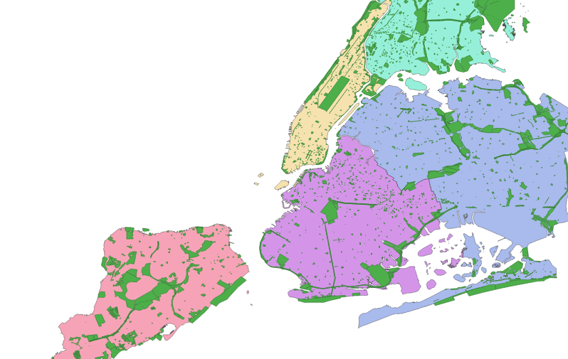
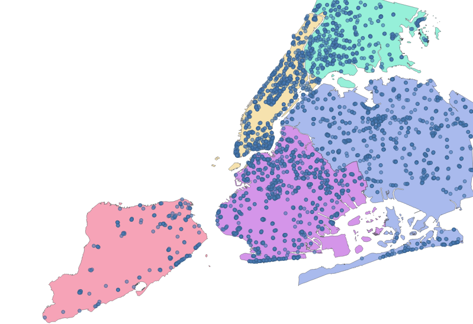

# Join the Party

Imagine living in New York City. Good pizza, Broadway, and one of the US's best collections of [open data](https://data.ny.gov/) have never felt closer to home. Other than pizza, what really makes a city great though, are the people who live there. Think about the people who help fill the blank spaces in your life. The shape of each relationship is usually a little different, but it's almost always possible to find some common ground. In this New York City life of our imagination, let's imagine some of the [Friends](https://en.wikipedia.org/wiki/Friends) we'd like to spend time with, and start to think about where we could all hang out.


<span class="photo-credit">Courtesy NBC</span>

## Drink from the Firehose

That cafe looks a bit stuffy and a bit dated. Instead, let's embrace the timeless joy of the great outdoors by putting together a list of parks in the city. Somewhere in these shaded shapes, we can see the faint outline of a party beginning to form:



Fortunately for us, we also have a list of every public drinking fountain that will let us sip some of NYC's ["world-renowned"](https://www1.nyc.gov/site/greenyc/take-action/drink-tap-water.page) tap water whenever the conversation starts to feel a little dry:



## Filtered Water

We have these two different data sources — drinking fountains and parks. Solving spatial problems often involves finding ways to stir things up. Let's see how many of these parks contain at least one of these drinking fountains.

<header class="codeblock-header">Count MultiPolygons That Contain at Least One Point</header>

```rust
use geojson::de::deserialize_features_from_feature_collection;
use geo::algorithm::Contains;

// a simple helper to open a file reader
fn reader(filename: &str) -> std::io::BufReader<std::fs::File> {
  let path = format!("src/data/nyc/{filename}");
  std::io::BufReader::new(std::fs::File::open(path).expect("file path must be valid"))
}

let parks: Vec<geo::MultiPolygon> = deserialize_features_from_feature_collection(reader("parks.geojson"))
    .map(|park_result: geojson::Result<geojson::Feature>| {
      // FIXME: Failing here
      let park_feature = park_result.expect("valid feature");
      geo::MultiPolygon::try_from(park_feature).expect("valid conversion")
    })
    .collect();

let fountains: Vec<geo::Point> = deserialize_features_from_feature_collection(reader("drinking_fountains.geojson"))
    .map(|feature_result: geojson::Result<geojson::Feature>| {
      let feature = feature_result.expect("valid Feature");
      geo::Point::try_from(feature).expect("valid conversion")
    }).collect();

let mut parks_with_fountains = 0;
for park in &parks {
  for fountain in &fountains {
    if park.contains(fountain) {
      parks_with_fountains += 1;
      break;
    }
  }
}

assert_eq!(parks_with_fountains, 902);

let parks_without_fountains = parks.len() - parks_with_fountains;
assert_eq!(parks_without_fountains, 1127);
```

A little less than half of NYC's parks have drinking fountains. Good to know!

## Thirst for Knowledge

Counting is simple, but oftentimes we will need to do something more complex like taking certain attributes from one data source and combining those attributes with another data source based on their spatial relationship.

Let's look at some selected data from two data sources:

**List of parks (same as above)**

| park_name            | park_shape                       |
|----------------------|----------------------------------|
| Gilbert Ramirez Park | `MULTIPOLYGON(((-73.93418260...` |
| Spargo Park          | `MULTIPOLYGON(((-73.89721950...` |
| Turtle Playground    | `MULTIPOLYGON(((-73.82693385...` |
| ...                  | ...                              |

**The five boroughs**

| borough_name | borough_shape                  |
|--------------|--------------------------------|
| Brooklyn     | `MULTIPOLYGON(((-73.86327...)` |
| Queens       | `MULTIPOLYGON(((-73.82644...)` |
| ...          | ...                            |

It's truncated in the tables above, but the park and borough data sources include detailed shape information. The smaller shapes of each *park* can be positioned within the larger shapes that comprise each *borough*. Because our friends live in different areas, a list like this could really help us narrow down where we want to get together:

> - Option 1: Gilbert Ramirez Park in Brooklyn
> - Option 2: Spargo Park in Queens
> - Option 3: Turtle Playground in Queens
> - ...

In order to produce a list like this, we need to combine the park name from the first data source with the borough that contains it from the second data source.

If you've worked with SQL before, you might be thinking that this sounds a bit like a [JOIN clause](https://en.wikipedia.org/wiki/Join_(SQL)), and you'll no doubt be delighted to know that this kind of operation is indeed referred to as a *spatial join*. If you've never worked with SQL before, don't worry, you have an even bigger reason to be delighted.

Let's start building a list of venues by combining each park with the name of the borough that the park is in.

<header class="codeblock-header">Combining Attributes From Multiple Features</header>

```rust
# use geo::geometry::{MultiPolygon, Point};
# use geo::algorithm::Intersects;
#
# use geojson::de::{deserialize_feature_collection_to_vec, deserialize_geometry};
#
# fn reader(filename: &str) -> std::io::BufReader<std::fs::File> {
#   let path = format!("src/data/nyc/{filename}");
#   std::io::BufReader::new(std::fs::File::open(path).expect("file path must be valid"))
# }

// Using what we learned in the previous section on Features, we'll
// deserialize the input GeoJSON into structs using serde.

// First Input
#[derive(serde::Deserialize)]
struct Park {
  #[serde(deserialize_with="deserialize_geometry")]
  geometry: geo::MultiPolygon,

  #[serde(rename="signname")]
  name: String
}

let parks = deserialize_feature_collection_to_vec::<Park>(reader("parks.geojson")).expect("valid geojson");

// Second Input
#[derive(serde::Deserialize)]
struct Borough {
  #[serde(deserialize_with="deserialize_geometry")]
  geometry: geo::MultiPolygon,

  #[serde(rename="boro_name")]
  name: String
}

let boroughs = deserialize_feature_collection_to_vec::<Borough>(reader("boroughs.geojson")).expect("valid geojson");

// Output
struct PartyVenue {
  park_geometry: MultiPolygon,
  park_name: String,
  borough_name: String,
}

let mut venues: Vec<PartyVenue> = Vec::new();

for park in &parks {
  for borough in &boroughs {
    if borough.geometry.intersects(&park.geometry) {
      let venue = PartyVenue {
        park_name: park.name.clone(),
        park_geometry: park.geometry.clone(),
        borough_name: borough.name.clone(),
      };
      venues.push(venue);
      break;
    }
  }
}

let first_venue = &venues[0];
assert_eq!(first_venue.park_name, "Devoe Park");
assert_eq!(first_venue.borough_name, "Bronx");

# // There's one phantom park in the data set that's outside of any borough boundaries — Wild!
# assert_eq!(venues.len(), parks.len() - 1);
```

We've produced a list of parks spatially joined to their borough name, but it's a huge list of options. How can we refine this list to surface only the best places?

## Water, Cooler

If [Central Park](https://www.nycgovparks.org/parks/central-park) is as mainstream as it gets, which open spaces are more like the avant-garde Vapor Wave Jazz that your hipster friends just can't get enough of these days? Let's augment our earlier code to filter out the mainstream (largest) parks, while still ensuring we'll be able to get a drink of New York's finest (water).

We want to produce something like this:

| park                         | borough   | fountains | square_meters |
|------------------------------|-----------|-----------|---------------|
| Tiny Town                    | Queens    | 2         | 100           |
| Polly Pocket Park            | Brooklyn  | 3         | 200           |
| Honey I Shrunk the Esplanade | Bronx     | 1         | 300           |
| ...                          | ...       | ...       | ...           |

<header class="codeblock-header">Combining Attributes From Multiple Features and Filtering the Result</header>

```rust
# use geo::geometry::{MultiPolygon, MultiPoint, Point};
# use geo::algorithm::{Area, Contains, Intersects};
#
# use geojson::de::{deserialize_feature_collection_to_vec, deserialize_feature_collection, deserialize_features_from_feature_collection, deserialize_geometry};
#
# fn reader(filename: &str) -> std::io::BufReader<std::fs::File> {
#   let path = format!("src/data/nyc/{filename}");
#   std::io::BufReader::new(std::fs::File::open(path).expect("file path must be valid"))
# }
#
# // First Input
# #[derive(serde::Deserialize, Debug)]
# struct Park {
#   #[serde(deserialize_with="deserialize_geometry")]
#   geometry: geo::MultiPolygon,
#
#   #[serde(rename="signname")]
#   name: String
# }
# let parks = deserialize_feature_collection_to_vec::<Park>(reader("parks.geojson")).expect("valid geojson");
#
# // Second Input
# #[derive(serde::Deserialize)]
# struct Borough {
#   #[serde(deserialize_with="deserialize_geometry")]
#   geometry: geo::MultiPolygon,
#
#   #[serde(rename="boro_name")]
#   name: String
# }
# let boroughs = deserialize_feature_collection_to_vec::<Borough>(reader("boroughs.geojson")).expect("valid geojson");
#
// Output
struct PartyVenue {
  park: String,
  borough: String,
  geometry: MultiPolygon,
  square_meters: f64,
  fountains: usize,
}

let mut venues: Vec<PartyVenue> = Vec::new();
for park in &parks {
  for borough in &boroughs {
    if borough.geometry.intersects(&park.geometry) {
      use proj::Transform;
      // Project the geometry in order to calculate a useful area.
      // See our first section for more on projections.
      //
      // EPSG:32115 - New York Eastern (meters)
      let square_meters = park.geometry
        .transformed_crs_to_crs("WGS84", "EPSG:32115")
        .expect("valid projection")
        .unsigned_area();

      let venue = PartyVenue {
        park: park.name.clone(),
        borough: borough.name.clone(),
        geometry: park.geometry.clone(),
        square_meters,
        fountains: 0, // we'll populate this field later
      };
      venues.push(venue);
      break;
    }
  }
}

let fountains: Vec<geo::Point> = deserialize_features_from_feature_collection(reader("drinking_fountains.geojson"))
    .map(|feature_result: geojson::Result<geojson::Feature>| {
      let feature = feature_result.expect("valid Feature");
      geo::Point::try_from(feature).expect("valid conversion")
    }).collect();

for fountain in &fountains {
  for venue in &mut venues {
    if venue.geometry.contains(fountain) {
      venue.fountains += 1;
      break;
    }
  }
}

// We're only interested in parks that have at least one water fountain
venues = venues.into_iter().filter(|venue| venue.fountains > 0).collect();

// Sort by the size of the park
venues.sort_by(|venue_1, venue_2| venue_1.square_meters.partial_cmp(&venue_2.square_meters).expect("valid floating point comparison"));

let tiniest_venue = venues.first().unwrap();
assert_eq!(tiniest_venue.park, "Glendale Veterans Triangle");
assert_eq!(tiniest_venue.borough, "Queens");
approx::assert_relative_eq!(tiniest_venue.square_meters, 26.263444242984757, epsilon = 1e-4);
assert_eq!(tiniest_venue.fountains, 1);

# let largest_venue = venues.last().unwrap();
# assert_eq!(largest_venue.park, "Pelham Bay Park");
# assert_eq!(largest_venue.borough, "Bronx");
# approx::assert_relative_eq!(largest_venue.square_meters, 10835186.669072341);
# assert_eq!(largest_venue.fountains, 43);
```

We have found some excellent candidates for a party. These off the beaten path parks will let us spend hours of quality time with our friends, all while staying hydrated. What more could you possibly ask for on a lazy day in New York City?

## Drowning in Data

One thing you could definitely ask for are quicker results. The code above works, but it's really quite slow! Until now we've basically brute forced our solutions without much consideration for speed. We can sort of justify our laissez-faire approach to CPU usage for one-off calculations like this, but speed will become increasingly important as our data sets grow larger and processing gets more complicated, or if results need to be recomputed more frequently.

Generally speaking, Rust is "real fast", but that's not the whole story. Let's say you're trying to get to [Harlem](https://en.wikipedia.org/wiki/Sugar_Hill,_Manhattan) in a hurry. If you happen to be [Tatyana McFadden](https://en.wikipedia.org/wiki/Tatyana_McFadden), five time winner and course record holder for the New York City Marathon women's weelchair division, you'd do all right. Alternatively, you could just recall that Duke Ellington tune and [take the A train](https://www.youtube.com/watch?v=1ggcQk67Mco&t=86s). With Rust's speedy physique as a baseline, the application of some problem-specific know-how will get you where you're going in record time.

In the next section we'll explore some of these tricks of the trade to speed up common geospatial operations. Quickly moving through the real world may require a jet engine, but that doesn't mean that your laptop needs to sound like one.
