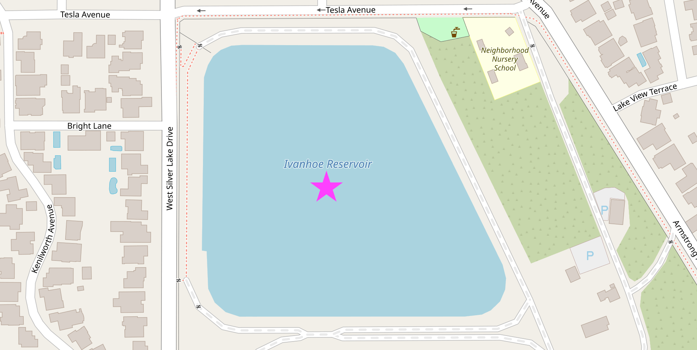
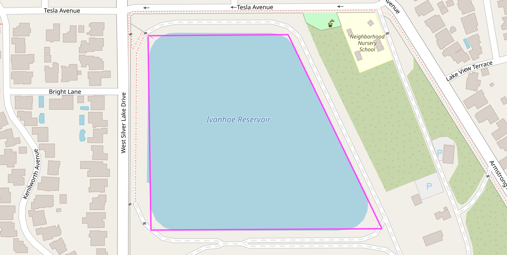

# You're Projecting

Just like any good argument, the best way to start spatial analysis is by projecting your points.

Almost everyone agrees that the world is a three-dimensional (and slightly smooshed) sphere. However, many spatial algorithms operate under the rustic assumptions of two-dimensional [euclidean geometry](https://en.wikipedia.org/wiki/Euclidean_geometry). When your input is defined in terms of latitude and longitude, the first step is to flatten (or "project") it onto 2D space.

## In-depth Perception

There are lots of ways to flatten a 3D thing into a 2D space, but this process inherently introduces some distortion (like an orange getting smashed in your backpack). Choosing the best possible "projection" for a given scenario is part of the art of being a geospatial analyst.

For applications spanning the globe, web mercator is a common projection that minimizes distortion for the majority of the inhabited planet. However, if you're focused on relative distance from a particular point, a Gnomonic projection might be a better choice.

 | 

If your work is more local in nature, you can use a projection method that is finely tuned for high accuracy within a relatively small and specific geographic area like [Zone 5 in Southern California](https://www.conservation.ca.gov/cgs/rgm/state-plane-coordinate-system#zone5), but if you try to use that same projection for something in [New York](https://en.wikipedia.org/wiki/New_York_City) (or, *alas and alack*, [old York](https://en.wikipedia.org/wiki/York)) your results will be way off!

Everything about this would be easier if the flat-earthers were right, but fortunately there are several well-rounded tools for our mostly-round earth.

## Co-Dependency

Our first group project(ion) will require some new dependencies.

The [PROJ](https://proj.org) coordinate transformation software has been helping people solve geospatial problems since the late 1970's. In addition to its longevity, it also stands out for its accuracy and speed. The [proj crate](https://crates.io/crates/proj) wraps and extends PROJ to make it feel right at home in your Rust application.

For its part, [well-known text](https://en.wikipedia.org/wiki/Well-known_text_representation_of_geometry) (WKT) is a very (sigh) well-known way of representing geometry as text, and the [wkt crate](https://crates.io/crates/wkt) adds read and write support for WKT to Rust.

Finally, we'll be using the [geo crate](https://crates.io/crates/geo) (a collection of geometry types and algorithms) to do some analysis.

Let's add these dependencies to our `Cargo.toml` file and get started:
```toml,ignore
[dependencies]
geo = "0.21.0"
proj = "0.27.0"
wkt = "0.10.3"
```

OK, now let's look for a body of water and dive right in.



This is the Ivanhoe reservoir in Los Angeles. Named after Sir Walter Scott's *Ivanhoe*, a stirring tale of romance and chivalry first published in 1819...

### Just Get to the Point

OK OK OK. We can use the `wkt` crate to create a `geo` geometry from the text representation of this point in the center of the water.

```rust
use geo::Point;
use wkt::TryFromWkt;

let wkt_string = "POINT(-118.265429 34.103175)";
let mut point: Point<f64> = Point::try_from_wkt_str(wkt_string).unwrap();
assert_eq!(point.x(), -118.265429);
assert_eq!(point.y(), 34.103175);
```

#### Personality Traits

Let's focus on this section of code from the example above: `Point::try_from_wkt_str`.

The [`Point`](https://docs.rs/geo/latest/geo/struct.Point.html) type, from the **`geo`** crate, calls the [`try_from_wkt_str`](https://docs.rs/wkt/latest/wkt/trait.TryFromWkt.html) method, from the **`wkt`** crate. Depending on your personality and background, this kind of cross-library interaction may feel either completely horrifying or utterly unremarkable. Many languages, like C++ or Java, don't really support adding methods to existing types like this, but more dynamic languages, like Ruby or Python, let you easily do all kinds of fun things like replacing or adding methods at runtime.

However, ultimately you reap what you sow. Unintentionally clobbering some existing method definition that was defined in a third-party module can quickly make "fun things" feel decidedly less fun. For that reason, even when they are supported, people often try to avoid these kinds of language gymnastics.

Rust tries to take an enlightened middle ground with its trait system. Rust supports adding shared functionality to existing types, but only in some *carefully* prescribed ways which avoid many of the problems with less-restrictive approaches. Rust's trait system is a core component of the language, and you can (and should!) read more about it in the [official documentation](https://doc.rust-lang.org/book/ch10-02-traits.html).

The main takeaway for now is this: **In Rust, functionality is often defined in terms of traits** and in order to be effective you'll need to `use` both the *traits* and the *types* which implement those traits (in this case `use wkt::TryFromWkt` and `use geo::Point` respectively).

## Trait-or

Another useful trait is the [`Transform`](https://docs.rs/proj/latest/proj/trait.Transform.html) trait, provided by the `proj` crate, which can be used to project geometries into a different [coordinate reference system](https://en.wikipedia.org/wiki/Spatial_reference_system).

Let's betray latitude and longitude, technically known as [*The World Geodetic System*](https://en.wikipedia.org/wiki/World_Geodetic_System), and transform our point in the center of the Ivanhoe reservoir to the [California State Plane Coordinate System](https://www.conservation.ca.gov/cgs/rgm/state-plane-coordinate-system).

```rust
# use geo::Point;
# use wkt::TryFromWkt;
#
# let wkt_string = "POINT(-118.265429 34.103175)";
# let mut point: Point<f64> = Point::try_from_wkt_str(wkt_string).unwrap();
#
use proj::Transform;

// Transform from WGS84 to EPSG:6423
// https://epsg.io/6423 - California zone 5 (meters)
point.transform_crs_to_crs("WGS84", "EPSG:6423").unwrap();

assert_eq!(point.x(), 1975508.4666086377);
assert_eq!(point.y(), 566939.9943794473);
```

If we want to export or share our results, the `wkt` crate can serialize a point's in-memory representation back to well-known text.

```rust
# use geo::Point;
# use wkt::TryFromWkt;
#
# let wkt_string = "POINT(-118.265429 34.103175)";
# let mut point: Point<f64> = Point::try_from_wkt_str(wkt_string).unwrap();
#
# use proj::Transform;
#
# // Transform from WGS84 to EPSG:6423
# // https://epsg.io/6423 - California zone 5 (meters)
# point.transform_crs_to_crs("WGS84", "EPSG:6423").unwrap();
#
use wkt::ToWkt;
let wkt_output = point.wkt_string();

assert_eq!(wkt_output, "POINT(1975508.4666086377 566939.9943794473)");
```

### Connect the Dots

Projecting a single point is simple enough. Let's try something a little more interesting.



People often say that the best way to learn is by making a mistake, so follow along as we do exactly that when calculating the area of this reservoir.

```rust
use geo::Polygon;
use wkt::TryFromWkt;
use geo::algorithm::area::Area;

let wkt_polygon = "POLYGON((-118.2662232 34.1038592,-118.2662339 34.1023485,-118.2639303 34.1023235,-118.2649125 34.1038878))";
let mut polygon: Polygon<f64> = Polygon::try_from_wkt_str(wkt_polygon).unwrap();

// 🤔 That's a suspiciously small number for so much water.
assert_eq!(polygon.unsigned_area(), 0.000002779367475015937);
```

Ivanhoe reservoir is large enough to hold over 400,000 [shade balls](https://en.wikipedia.org/wiki/Shade_balls), so any area measurement that begins with `0.00000...` is highly suspect. Because our polygon was described in degrees (unprojected coordinates), the units of area we just computed are in "square degrees" which is not a very useful measurement. A degree near the North Pole is very different from a degree near the equator (and not just in terms of temperature).

To get a reasonable result, we should first project the polygon to a euclidean coordinate reference system that is suitable for Los Angeles.

```rust
# use geo::Polygon;
# use wkt::TryFromWkt;
# use geo::algorithm::area::Area;
#
# let wkt_polygon = "POLYGON((-118.2662232 34.1038592,-118.2662339 34.1023485,-118.2639303 34.1023235,-118.2649125 34.1038878))";
# let mut polygon: Polygon<f64> = Polygon::try_from_wkt_str(wkt_polygon).unwrap();
#
use proj::Transform;
// Transform from WGS84 to EPSG:6423
// https://epsg.io/6423 - California zone 5 (meters)
polygon.transform_crs_to_crs("WGS84", "EPSG:6423").unwrap();

// Now we can get a useful "square meters" measurement.
assert_eq!(polygon.unsigned_area().round(), 28447.0);
```

Notice that we can transform this polygon the same way we previously transformed a single point. Now we know that approximately 28.4k square meters are required to hold 400k floating spheres in one small spot on the floating (slightly smooshed) sphere we call home, and we've solved a story problem that we were never even asked.

## Working with What You've Got

That's a quick look at some of the basics of working with geometry in Rust. Next, we'll take a look at how to use file formats like CSV and GeoJSON that support *features* to go beyond just the shape of things.
